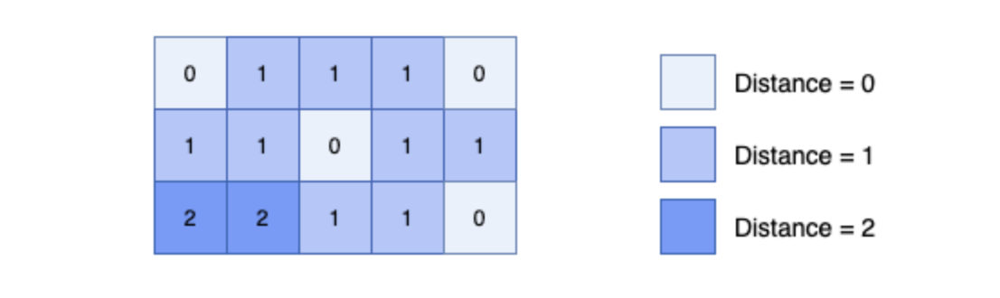

> Given an m x n binary matrix mat, return the distance of the nearest 0 for each cell.

The distance between two adjacent cells is 1.


mat.size(); mat[0].size()

> Input: mat = [[0,0,0],[0,1,0],[1,1,1]] <br>
Output: [[0,0,0],[0,1,0],[1,2,1]]

> 因為需計算非０的cell 到最近0 的最短距離為 ？
> 將所有非0 都標記為-1, 且將cell = 0 搜集起來作為起始點
> 由所有cell = 0 作爲起點; 用topology sort 去追蹤4個方向的內容
> 當四個方向內入有標記為-1, 就將來源 + 1 作為新內容
> 最後將其更新cell 的座標加入queue中

* For convinience, let's call the cell with value 0 as zero-cell, the cell has with value 1 as one-cell, the distance of the nearest 0 of a cell as distance.
* Firstly, we can see that the distance of all zero-cells are 0.
* Same idea with Topology Sort, we process zero-cells first, then we use queue data structure to keep the order of processing cells, so that cells which have the smaller distance will be processed first. Then we expand the unprocessed neighbors of the current processing cell and push into our queue.
* Afterall, we can achieve the minimum distance of all cells in our matrix.



```shell
chosen element of mat is 0 and record queue<[row,col]>
e.g. [0,0], [0,1], [0,2], [1,0], [1,2]

dir = {[1,0], [0,1], [-1,0], [0,-1]}


```
